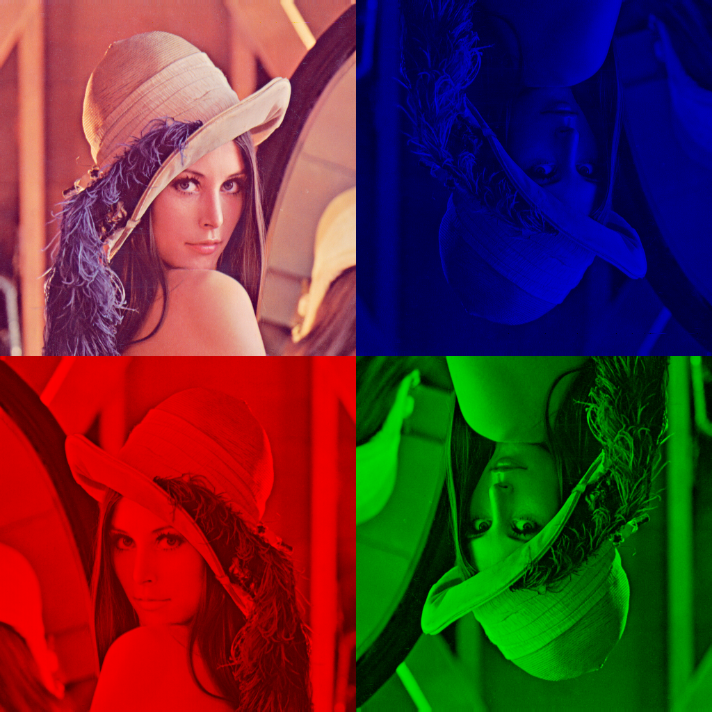
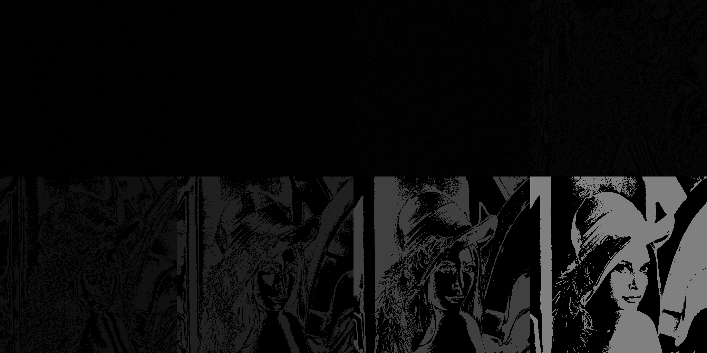

# Image Mosaic & Bit Splicing Challenge

This project contains two Python scripts for image processing:

- **mosaic_rgb.py**: Creates a mosaic effect by manipulating RGB color channels.
- **bit_splicing.py**: Demonstrates bit-level splicing on images.

## Requirements

Install dependencies using pip:

```bash
pip install numpy opencv-python pillow
```

## Usage

### Mosaic with Color Channels

```bash
python mosaic_rgb.py Leyla.png
```

### Bit Splicing

```bash
python bit_splicing.py Leyla.png
```

Replace `Leyla.png` with any image file you want to process.

## Output

Processed images will be saved in the current directory with descriptive filenames.

## Example

Here are sample images demonstrating the input and outputs:

| Original Image | Mosaic Effect | Bit Splicing Effect |
|:--------------:|:-------------:|:-------------------:|
|  |  |  |


## Troubleshooting

- Ensure your image file exists in the project directory.
- If you encounter missing package errors, re-run the pip install command above.

## Credits

Created for a coding challenge by seannguyen-code.

